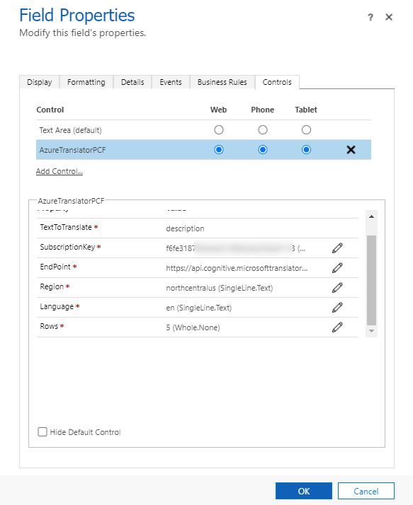

# Azure-Translator-PCF
Azure Translator is a simple PCF for translating text with automatic language detection using Azure Translator service.

The demonstration below illustrates the translation of a field 
Multiple lines of text and an email that is formatted in HTML.

## Prerequisites
- Azure subscription - Create one for free !
- Once you have an Azure subscription, create a Translator resource in the Azure portal to get your key and endpoint. After it deploys, select Go to resource.
  - You'll need the key and endpoint from the resource to connect the PCF to the Translator service. You'll paste your key and endpoint into PCF configuration.
  - You can use the free pricing tier (F0) to try the service, and upgrade later to a paid tier for production.

https://docs.microsoft.com/en-us/azure/cognitive-services/translator/

## Configuration
- TextToTranslate: Single Line, Multiple Line: Bound
- SubscriptionKey: https://docs.microsoft.com/en-us/azure/cognitive-services/translator/translator-how-to-signup#authentication-key
- EndPoint: https://docs.microsoft.com/en-us/azure/cognitive-services/translator/translator-how-to-signup#authentication-key
- Region: https://docs.microsoft.com/en-us/azure/cognitive-services/translator/translator-how-to-signup#authentication-key
- Language: https://docs.microsoft.com/en-us/azure/cognitive-services/translator/language-support
  - Examples: en, it, es, fr ..
- Rows: Rows number for Multiple Line of text

